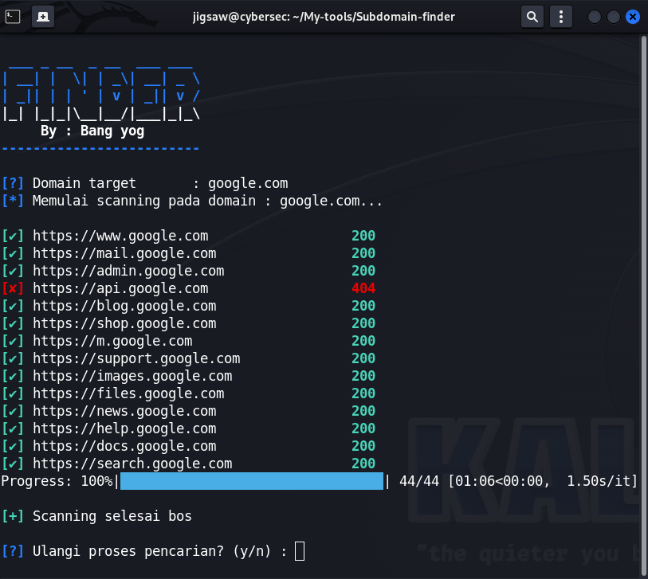

# 🌐 Subdomain Finder

Tools sederhana berbasis Python untuk melakukan pencarian subdomain pada sebuah domain target.  
Dibuat untuk tujuan edukasi dan pentesting, bukan untuk aktivitas ilegal.  

---

## ✨ Fitur
- Mencari subdomain aktif dari sebuah domain
- Support wordlist custom
- Menampilkan status HTTP dari subdomain yang ditemukan
- Ringan, simple, bisa dijalankan di semua OS (Linux/Windows)

---

## 📦 Instalasi
Clone repository ini:

```bash
git clone https://github.com/YogaRmdn/Subdomain-Finder.git
cd Subdomain-Finder
python find.py
```


